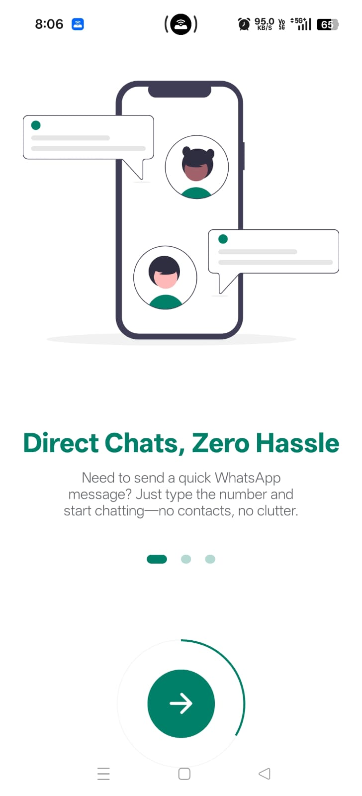
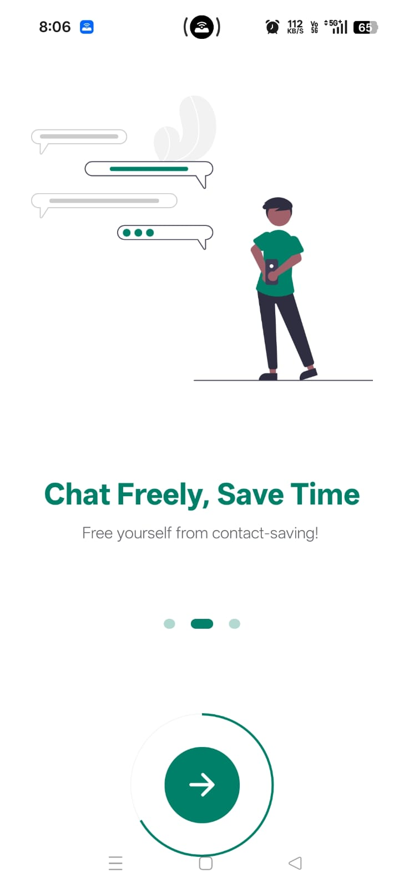
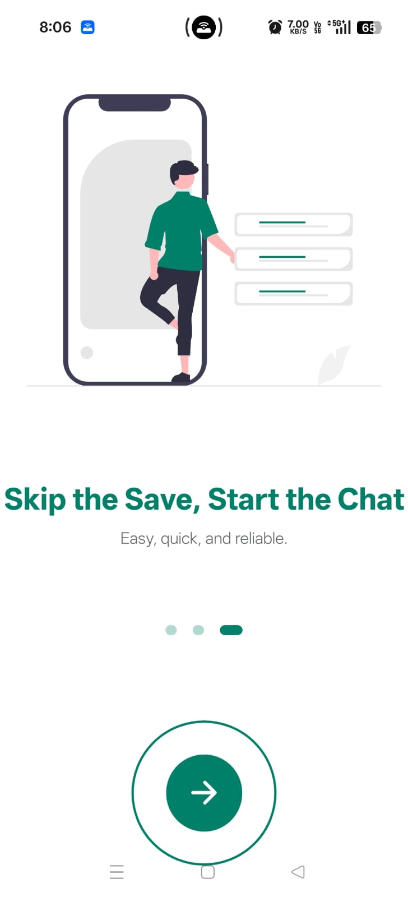
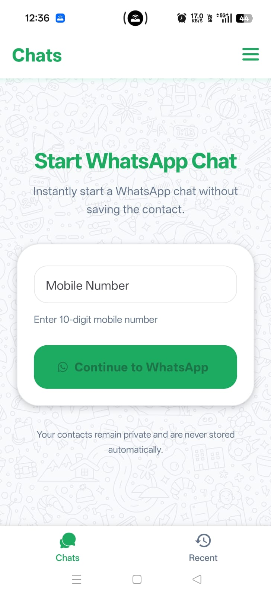
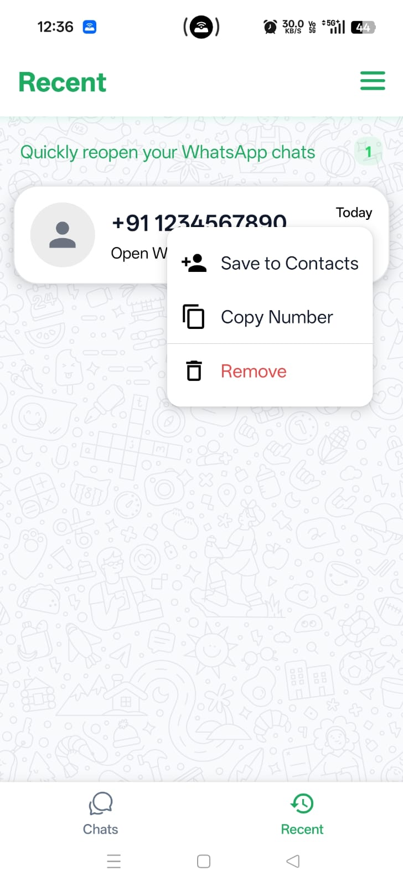
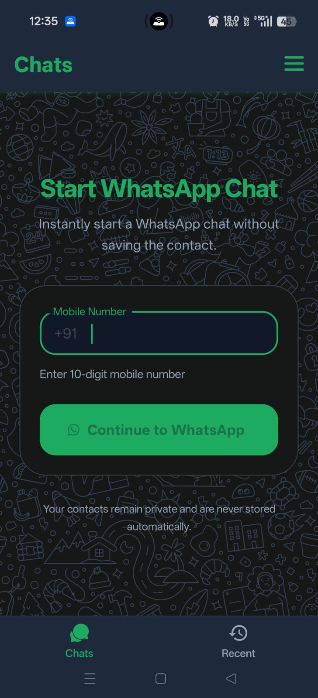
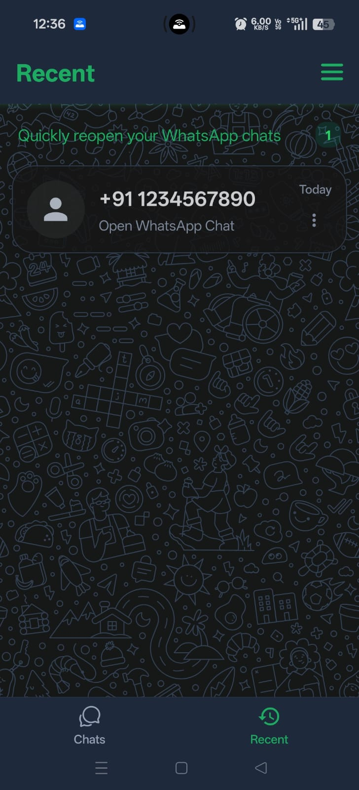
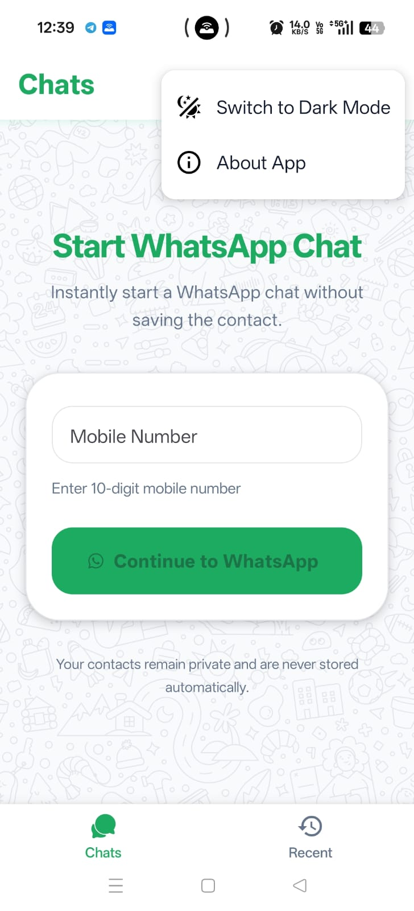

<div align="center">
  
  <h1>Wchat</h1>
  <p><strong>WhatsApp Chats Without Saving Contacts</strong></p>
  <p>
    <a href="https://github.com/ermanoj-sharma/Wchat/releases/latest">
      
    </a>
    <a href="#">
      
    </a>
    <a href="#">
      
    </a>
  </p>
</div>

---

## 📱 Overview

**Wchat** is a lightweight React Native (Expo) mobile app that lets you start WhatsApp conversations instantly — **without saving the contact** to your phonebook. Just enter a 10-digit Indian mobile number, tap the button, and you're chatting. It also keeps a history of your recent chats for quick access.

Built with privacy in mind: your contacts are never stored automatically.

---

## ✨ Features

| Feature | Description |
|---|---|
| **Direct Chat** | Enter any 10-digit Indian number (+91) and open WhatsApp instantly |
| **Recent History** | Saves last 30 chats with timestamps, sorted newest-first |
| **Quick Actions** | Re-open, copy number, save to contacts, or delete from recent list |
| **Onboarding** | 3-slide carousel for first-time users |
| **Dark Mode** | Toggle between light and dark themes |
| **Privacy-First** | No contact data is stored or uploaded anywhere |

## Screenshots

### Onboarding

| Screen 1 | Screen 2 | Screen 3 |
|:---:|:---:|:---:|
|  |  |  |

---

### Home Tabs

#### Light Mode

| Direct Chat | Recent Chats |
|:---:|:---:|
|  |  |

#### Dark Mode

| main Chat | Recent Chats |
|:---:|:---:|
|  |  |

---

### Actions Menu

| Menu |
|:---:|
|  |

> _Note: Replace these with actual device screenshots for a polished README._

---

## 🛠 Tech Stack

| Category | Technology |
|---|---|
| **Framework** | [React Native](https://reactnative.dev/) 0.81.5 |
| **Platform** | [Expo](https://expo.dev/) SDK 54 |
| **Language** | JavaScript (JSX) |
| **Navigation** | [Expo Router](https://docs.expo.dev/router/introduction/) (file-based) |
| **Styling** | [NativeWind](https://www.nativewind.dev/) v4 + Tailwind CSS |
| **UI Library** | [React Native Paper](https://callstack.github.io/react-native-paper/) (MD3) |
| **Icons** | [@expo/vector-icons](https://docs.expo.dev/guides/icons/) (Ionicons, MaterialIcons, AntDesign) |
| **Storage** | [AsyncStorage](https://react-native-async-storage.github.io/async-storage/) |
| **Animations** | [react-native-reanimated](https://docs.swmansion.com/react-native-reanimated/) |
| **SVG** | [react-native-svg](https://github.com/software-mansion/react-native-svg) |
| **Build/Deploy** | [EAS Build](https://docs.expo.dev/build/introduction/) |

### Key Expo Modules

- `expo-intent-launcher` — Opens WhatsApp via Android intent
- `expo-clipboard` — Copy phone numbers
- `expo-contacts` — Save numbers to device contacts (iOS)
- `expo-linking` — URL fallback for opening WhatsApp

---

## 📁 Project Structure

```
Wchat/
├── app/                          # Expo Router pages
│   ├── _layout.jsx               # Root layout (PaperProvider, Stack)
│   ├── index.jsx                 # Entry: onboarding check + navigation
│   └── (tabs)/
│       ├── _layout.jsx           # Bottom tab layout
│       ├── home/index.jsx        # Main "Direct Chat" screen
│       └── recent/index.jsx      # Recent chats list
├── assets/
│   └── images/                   # App images & screenshots
├── components/                   # Reusable UI components
│   ├── AboutAppModal.jsx
│   ├── HeaderMenu.jsx
│   ├── NextButton.jsx
│   ├── Onboarding.jsx
│   ├── OnboardingItem.jsx
│   ├── Paginator.jsx
│   └── RecentList.jsx
├── constant/
│   └── slides.js                 # Onboarding slide data
├── service/
│   ├── storage.js                # AsyncStorage CRUD for recent chats
│   ├── onboarding.js             # Onboarding flag helpers
│   └── debug.js                  # Debug overlay utility
├── app.json                      # Expo configuration
├── eas.json                      # EAS Build config
├── package.json
├── tailwind.config.js
├── babel.config.js
├── metro.config.js
├── global.css
└── Notes.Md                      # Developer setup notes
```

---

## 🚀 Getting Started

### Prerequisites

- **Node.js** v22.12.0 (or later)
- **npm** 10.9.0 (or later)
- **Expo CLI**: `npx expo`
- **EAS CLI** (for builds): `npm install -g eas-cli`
- **Android device** or emulator (for intent-based features)

### Installation

```bash
# 1. Clone the repository
git clone https://github.com/ermanoj-sharma/Wchat.git
cd Wchat

# 2. Install dependencies
npm install

# 3. Start the development server
npm start
# or: npx expo start --tunnel
```

### Running on a Device

```bash
# Android
npm run android

# iOS (limited intent support)
npm run ios

# Web
npm run web
```

### Clear Cache

```bash
npx expo start --tunnel --clear
```

---

## 📦 Building APK

### Preview Build (downloadable APK, no store required)

```bash
eas build -p android --profile preview
```

### Production Build

```bash
eas build --platform android
```

> **Note**: You need to log in to an Expo account (`eas login`) and run `eas build:configure` first.

---

## 🔧 Available Scripts

| Script | Command | Description |
|---|---|---|
| `start` | `expo start --tunnel` | Start dev server with tunnel (works over LAN/internet) |
| `android` | `expo start --android` | Start + launch on Android device/emulator |
| `ios` | `expo start --ios` | Start + launch on iOS simulator |
| `web` | `expo start --web` | Start + launch in web browser |

---

## 🎨 Customization

### Theme Colors

The app uses WhatsApp-branded green tones. Edit `tailwind.config.js`:

```js
colors: {
  'green': "#008068",
  'green-light': "#26d466",
  'dark-green': '#222e36',
  'dark-green-light': '#00a884',
}
```

### Country Code

The default country code is `+91` (India). You can change it in `app/(tabs)/home/index.jsx`.

### Onboarding Slides

Edit slide content in `constant/slides.js`.

---

## 📄 License

This project is **private** — all rights reserved by Manoj Sharma.

---

## 👨‍💻 Developer

**Manoj Sharma**

- 📧 [contact.manojsharma@outlook.com](mailto:contact.manojsharma@outlook.com)
- 🌐 [Portfolio](https://er-manoj-sharma.netlify.app/)
- 🐙 [GitHub](https://github.com/ermanoj-sharma)
- 📲 [Download Latest APK](https://github.com/ermanoj-sharma/Wchat/releases/latest)

---

## 📝 Notes

- The app is **primarily designed for Android** — it uses Android intents to open WhatsApp and save contacts.
- iOS support is configured but some features (intents) may have limited functionality.
- **No backend or server** is required — everything runs on-device with AsyncStorage.
- Privacy is a core principle: your contacts are never stored or transmitted anywhere.
- The app handles Android's hardware back button to exit the app gracefully.
